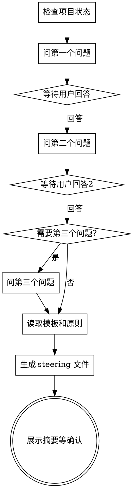

# 项目初始化

## Overview

通过交互式对话理解项目需求，生成高质量的 steering 项目记忆，为后续开发奠定基础。

先理解，再生成。一次问一个问题，逐步深入。

<HARD-GATE>
在完成所有澄清问答之前，绝对不可以生成任何 steering 文件（product.md, tech.md, structure.md）。
不论项目看起来多简单，都必须至少问 2 个澄清问题。
这条规则没有例外。
</HARD-GATE>

## Anti-Pattern: "这个项目很简单，不需要问"

每个项目都必须经过问答流程。计算器、todo list、单个工具函数 — 都一样。
"简单"的项目正是未经检验的假设最容易浪费工作的地方。
问答可以短（真正简单的项目 2 个问题就够），但你必须问并等待回答。

## Checklist

You MUST create a task for each of these items and complete them in order:

1. **检查项目状态** — 检查 `.yy-dev/` 是否已存在，扫描项目文件
2. **第一轮澄清** — 问第一个关键问题（产品定位/核心差异化/目标用户），等待回答
3. **第二轮澄清** — 根据回答问第二个问题（技术偏好/功能范围/设计风格），等待回答
4. **第三轮澄清（可选）** — 如果仍有重要不确定点，再问一个，否则跳过
5. **生成 steering** — 读取模板和原则，生成三个文件到 `.yy-dev/steering/`
6. **用户确认** — 展示 steering 摘要，确认是否需要调整
7. **询问称呼** — 问用户希望怎么称呼他们，默认叫 "baby"，写入 `.yy-dev/steering/user.md`

## Process Flow



## Execution Details

### Step 1: 检查项目状态

- 检查 `.yy-dev/` 是否已存在
- 如果存在且有 steering：警告用户，问是否重新生成
- `Glob` 扫描项目文件（package.json, README, 源代码等）
- 空项目 → greenfield 模式；有代码 → brownfield 模式

### Step 2-4: 交互式澄清

**每次只问一个问题，等待回答后再问下一个。**

问题方向（根据上下文选择最重要的）：

- **产品方向**: 核心差异化是什么？解决什么问题？目标用户是谁？
- **技术偏好**: 有没有技术栈偏好？有没有约束（浏览器兼容性、性能要求）？
- **功能范围**: MVP 包含哪些核心功能？哪些是 P0 vs P1？
- **设计风格**: 视觉/交互有什么偏好？有参考产品吗？
- **集成需求**: 需要对接什么外部服务/API？

**提问技巧**:
- 优先用选择题（给 2-3 个选项 + "其他"）
- 结合用户的描述追问，不要问泛泛的问题
- 体现你对领域的理解，给出专业建议

### Step 5: 生成 Steering

**只有在完成至少 2 轮问答后才能执行此步骤。**

1. 创建目录结构：
```bash
mkdir -p .yy-dev/steering .yy-dev/specs
```

2. 读取模板：
   - `${CLAUDE_PLUGIN_ROOT}/templates/steering/product.md`
   - `${CLAUDE_PLUGIN_ROOT}/templates/steering/tech.md`
   - `${CLAUDE_PLUGIN_ROOT}/templates/steering/structure.md`
   - `${CLAUDE_PLUGIN_ROOT}/templates/rules/steering-principles.md`

3. 生成三个文件到 **`.yy-dev/steering/`** 目录（不是 `.yy-dev/` 根目录）：
   - `.yy-dev/steering/product.md` — 产品定位、目标用户、核心价值、差异化
   - `.yy-dev/steering/tech.md` — 技术栈、架构决策、开发规范
   - `.yy-dev/steering/structure.md` — 项目结构、目录组织、命名约定

4. **所有内容必须是简体中文**

### Step 6: 展示摘要并确认

展示生成的 steering 摘要，问用户是否需要调整。

### Step 7: 询问称呼

在一切确认完毕后，最后问用户：

> "最后一个问题 — 我怎么称呼你？（默认叫你 baby 😄）"

- 如果用户提供了称呼 → 使用用户提供的
- 如果用户说"默认"或直接回车/不回答 → 使用 "baby"
- 将称呼写入 `.yy-dev/steering/user.md`：

```markdown
# 用户偏好

## 称呼
baby
```

后续所有 yy-dev 工作流输出时，用这个称呼来称呼用户。

## After Initialization

**只建议以下真实存在的命令：**
- `/yy:feature "描述"` — 直接开始实现功能
- `/yy:spec-requirements <名称>` — 走正式需求规格流程
- `/yy:fix "描述"` — 修复 bug

**绝对不要建议不存在的命令**（如 `/yy:brainstorming` 不存在）。
如果觉得用户需要头脑风暴，直接说"我们可以先讨论一下具体方案"，不要引用不存在的命令。

## Key Principles

- **一次一个问题** — 不要一次问多个问题
- **选择题优先** — 比开放式问题更容易回答
- **YAGNI** — 不要在 steering 里规划过多未确定的功能
- **模式而非清单** — 记录架构模式，不是文件列表
- **安全** — 绝不在 steering 里包含密钥、密码等敏感信息
